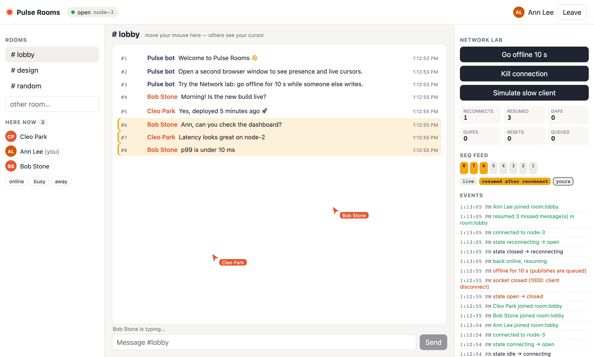
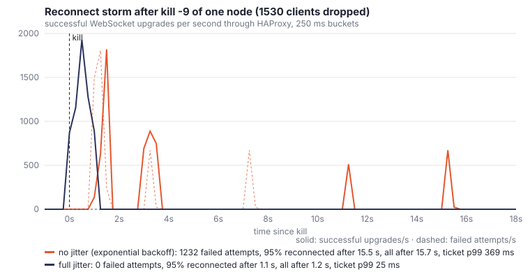
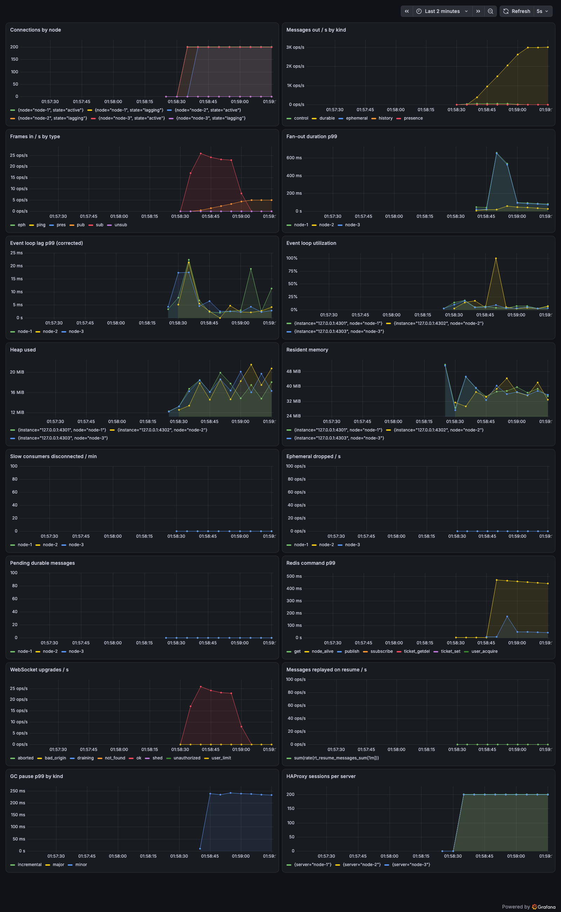

# Node Realtime Engine

A WebSocket server in plain Node.js (`node:http` + `ws`, no frameworks) with ordered durable channels, presence, resume after reconnect, backpressure and horizontal scaling — plus a client SDK, a demo app and a load generator that measures all of it.




*Pulse Rooms demo: chat, presence avatars, live cursors and the Network lab. The highlighted messages were missed during a 10-second offline period and replayed on reconnect.*

## Why this project

Most realtime backends hide the runtime behind Socket.IO or a managed service. This one is small enough to read in an evening and is built to answer runtime questions with numbers: what a connection costs, what happens to the event loop when a room has 6 000 subscribers, why a reconnect storm turns into waves, and why `XADD` and `PUBLISH` have to be one atomic step.

## Highlights

- **Plain Node.js:** `node:http` + `ws` with `noServer` and a manual `handleUpgrade`; dependencies are `ws`, `ioredis`, `pino`, `prom-client`, `msgpackr`. Frame validation is a 200-line validator that is 1.9–8.8× faster than zod on the hot path.
- **Total order per channel across nodes** via one atomic Lua script (`INCR` + `XADD 0-seq` + `SPUBLISH` + `cmid` idempotency). Doing it with separate commands produced 1 205 out-of-order deliveries out of 4 000 in the benchmark; the script produces 0. A fast-check property test runs concurrent publishers on different nodes and checks every subscriber sees one identical gapless sequence.
- **Resume from any node:** `sub {from: lastSeq}` replays history from the Redis stream and merges it with live messages buffered during the read, or sends an explicit `reset` when history is trimmed or the gap exceeds 5 000. A churn test with 12 249 reconnects replayed 912 011 messages with 0 gaps and 0 duplicates.
- **Backpressure-aware fan-out:** one encoded buffer per message per codec, chunked delivery with `setImmediate` for rooms above 1 000 local subscribers, LOW/HIGH/HARD watermarks with a pending queue, `lag` frames and `4008` for slow consumers. Serialize-once alone took a 6 000-subscriber fan-out from p50 2.7 s (saturated) to 25 ms.
- **Graceful drain and jittered reconnects:** SIGTERM flips readiness, sends `drain{after: random(0..10 s)}`, then closes stragglers with `1001`. After `kill -9` of a node, clients with full jitter were all back in 1.2 s with 0 failed attempts; without jitter 1 232 attempts failed and recovery took 15.7 s.
- **Tickets, not tokens in URLs:** a one-time ticket (`GETDEL`, 30 s TTL) is checked before the upgrade, so a bad request gets `401` without a WebSocket ever being created; Origin allowlist, per-connection token buckets, subscription and connection limits, load shedding with `503`.
- **Observability:** Prometheus metrics for connections, fan-out duration, buffered bytes, slow consumers, resume volume, Redis latency, event loop delay and utilisation, GC pauses; a Grafana dashboard; per-connection debug logging switchable at runtime.

## Architecture

```mermaid
flowchart LR
  B[Browsers / SDK] -->|wss /v1/connect?ticket| H[HAProxy :4300<br/>leastconn, no sticky]
  A[auth-stub] -->|POST /v1/tickets| H
  H --> N1[node-1] & N2[node-2] & N3[node-3]
  N1 & N2 & N3 -->|Lua publish, XRANGE, presence| R[(Redis<br/>streams + sharded pub/sub)]
  R -->|SSUBSCRIBE fan:{ch}| N1 & N2 & N3
  P[Prometheus] --> N1 & N2 & N3
```

A publish on any node runs one Lua script that assigns the next `seq`, appends to the channel's stream with id `0-seq`, stores the `cmid`, and `SPUBLISH`es to the channel's shard. Each node subscribes only to channels its local clients use and fans each message out once-encoded to local subscribers through per-connection backpressure. A reconnecting client resumes from its last `seq` on whichever node HAProxy picks. Presence is per user (three tabs = one avatar) with heartbeats and a lock-protected sweeper that removes users of dead nodes.

## Tech stack

| Layer | Technology | Why |
|---|---|---|
| Server | Node.js, `node:http`, `ws` | Full control over upgrade, backpressure and timers |
| State, ordering, fan-out | Redis 8 streams + sharded pub/sub + Lua | Atomic ordering, history for resume, cluster-ready hash tags |
| Protocol | Own frame spec, JSON or MessagePack subprotocol | Short field names, versioned subprotocols |
| Client SDK | TypeScript, tsup (ESM + CJS + d.ts), browser and Node | Resume, dedupe, offline queue, presence, jittered backoff |
| Demo | React 19 + Vite | Pulse Rooms with a Network lab |
| Load testing | Own generator on `worker_threads` | Seq correctness and latency in the same process |
| Ops | HAProxy, Prometheus, Grafana, Docker Compose | Health-checked leastconn without sticky sessions |

## Getting started

```bash
docker compose -f infra/docker-compose.yml up --build    # 3 nodes, HAProxy, Redis, demo on :4321, Grafana on :4391
```

Without Docker (Redis on :6379 and `haproxy` on PATH):

```bash
pnpm install && pnpm build
pnpm cluster:up && pnpm seed
node scripts/cluster.mjs up --demo   # or: pnpm dev:demo
```

With Prometheus (:4390) and Grafana (:4391, dashboard provisioned): `node scripts/cluster.mjs up --grafana`. Homebrew Grafana 13 needs a local copy of the Prometheus datasource plugin, because downloads are disabled; set `GRAFANA_PROMETHEUS_PLUGIN` to point at it.

Open http://localhost:4321 in two windows.

## Testing

| Level | Command | What |
|---|---|---|
| Unit (99) | `pnpm test:unit` | validator, codecs, token bucket, history/live merge, backpressure watermarks, per-user limiter, metrics, client state machine with a fake socket |
| Integration (60) | `pnpm test:int` | real Redis: pub/sub, resume on another node, `cmid` idempotency, `reset`, cross-node property test, presence after a node crash, slow vs fast client, drain, heartbeat, client SDK in Node, cluster-wide per-user limit across two nodes (crash, restart, stall recovery) |
| Browser + e2e (9) | `pnpm test:pw` | SDK in Chromium (JSON and MessagePack), Pulse Rooms with two browsers: chat, presence, offline → resume fills the gap |
| Smoke (12 checks) | `pnpm smoke` | 3 nodes + HAProxy: publish, `kill -9` the node a client is on, gapless resume elsewhere, presence cleanup, the 11th connection of a user across 3 nodes gets `4029`, the dead node's count is released |
| Observability | `pnpm verify:observability` | Prometheus + Grafana started locally, dashboard checked over Grafana's HTTP API, all 16 panel queries return data under load, screenshot |

## Performance

Environment: one Apple Silicon laptop (8 cores, 8 GB RAM), Node 26, Redis 8 on localhost; 3 server nodes, HAProxy, Redis and the load generator on the same machine, which was also running other applications. Sizes are bounded by macOS file-descriptor limits (10 240 per process, 30 720 per system). Measured 2026-10-01 with `scripts/bench-all.sh`; raw data in `results/`.

| Scenario | Connections | Msgs out/s | p50 | p99 | Event loop p99 | Notes |
|---|---|---|---|---|---|---|
| idle | 9 000 | — | — | — | — | 5.5 KB heap per connection |
| fanout-big-room (1 room, 5 msg/s) | 6 000 | 30 000 | 22.6 ms | 60.8 ms | 20.7 ms | 0 gaps |
| many-rooms (165 rooms, 10 Hz cursors) | 1 000 | 57 000 | 8.7 ms | 559 ms | 359 ms | 0 gaps; 3 000 saturates the laptop |
| slow-consumers (5 % not reading) | 1 000 | 61 000 | 7.0 ms | 243 ms | 244 ms | slow clients cut, others unaffected |
| resume (random 1–30 s disconnects) | 3 000 | 15 000 | 1.0 ms | 89 ms | 179 ms | 912 011 replayed, 0 gaps, 0 dups |
| reconnect storm, full jitter | 4 590 | — | — | ticket p99 25 ms | 6 ms | 0 failed attempts, all back in 1.2 s |
| reconnect storm, no jitter | 4 590 | — | — | ticket p99 369 ms | 16 ms | 1 232 failed attempts, 15.7 s |





The full write-up with before/after measurements — connection memory, serialize-once, shared heartbeat timer, chunked fan-out, JSON vs MessagePack, permessage-deflate, reconnect storms, atomic publish, file-descriptor limits, a `--cpu-prof` breakdown of fan-out (32 % of busy time is the `writev` syscall, 7 % is engine code), a heap-snapshot diff proving connections are released, and the observability check — is in [docs/LEARNINGS.md](docs/LEARNINGS.md).

## Architecture Decisions

- [0001 Atomic Lua publish](docs/adr/0001-atomic-lua-publish.md)
- [0002 One-time tickets](docs/adr/0002-ticket-auth.md)
- [0003 No sticky sessions](docs/adr/0003-no-sticky-sessions.md)
- [0004 `terminate()` and one heartbeat timer](docs/adr/0004-terminate-dead-connections.md)
- [0005 Serialize once, chunked fan-out](docs/adr/0005-serialize-once-chunked-fanout.md)
- [0006 Backpressure policy](docs/adr/0006-backpressure-policy.md)
- [0007 Own validator](docs/adr/0007-own-validator.md)
- [0008 Presence per user](docs/adr/0008-presence-per-user.md)
- [0009 Cluster-wide per-user connection limit](docs/adr/0009-cluster-wide-user-connection-limit.md)

Protocol: [docs/PROTOCOL.md](docs/PROTOCOL.md) · Design: [docs/SPEC.md](docs/SPEC.md)

## Known limitations & next steps

- All numbers come from one laptop with everything on loopback; the next step is the same scenarios on separate VPS machines with several load-generator IPs, where 10k–50k connections are possible.
- Many small rooms with 10 Hz cursors are bounded by one `ws.send` syscall per frame per recipient; batching frames per socket per tick (cork/uncork) is the next optimisation to measure.
- After a `kill -9`, a dead node's connections still count against the cluster-wide per-user limit until the sweeper reaps the node (15–25 s with defaults).
- History retention by age is enforced lazily on publish; an idle channel keeps old entries until its next publish.
- Redis is a single instance; keys use hash tags so the scripts are Redis Cluster–ready, but cluster mode was not tested.
- The Docker Compose setup was written but not run in this environment; the local cluster uses Node processes and HAProxy directly.
